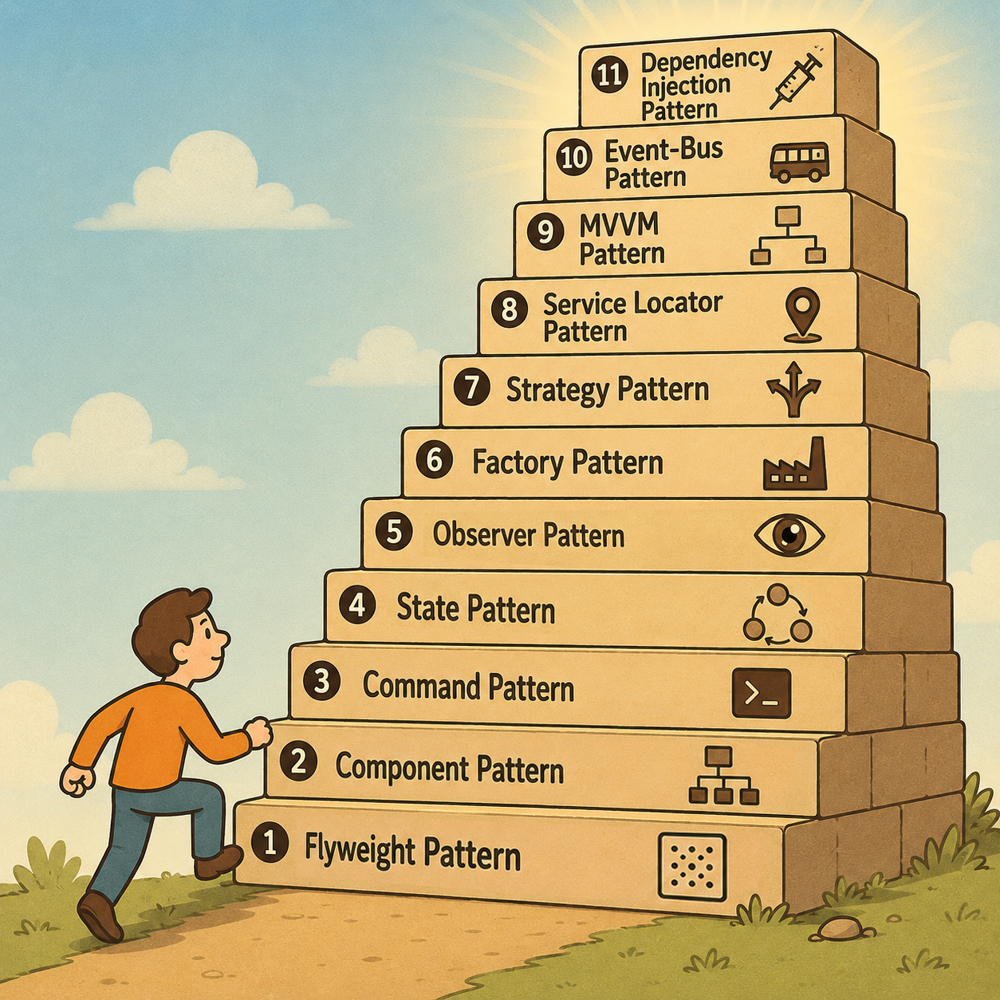

### Hakkımda
Hi 👋, I'm Unity blogger from Turkey

- **Engineering**: 
- **Project Setup & Settings**: 
- **User Interface**: 
- **Physics**: 
- **3rd Libraries**: 

---

  

---

# Correct collider/trigger settings in the Unity scene

## 1. The Most Important Unity Physics Rule

For `OnTriggerEnter` to work:

- ✅ Both objects must have Collider
- ✅ At least one of them must have a Rigidbody
- ✅ In colliders with triggers, `Is Trigger` must be enabled

---

## Last Working Structure

### Player

* Rigidbody
* Collider
* Tag = Player

### EndTrigger

* Collider
* Is Trigger ✔
* EndTrigger Script

### GameManager

* CompleteLevelUI assigned

---

## Test

Press Play:

* Once the player enters the trigger area:

  * `CompleteLevelUI` should open
  * Type `build index` in the console
